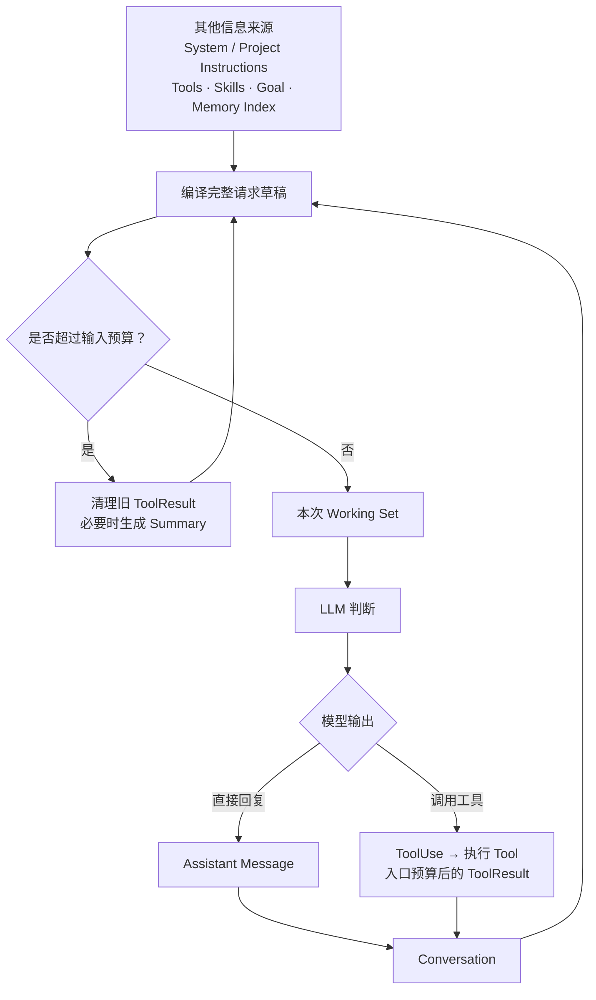
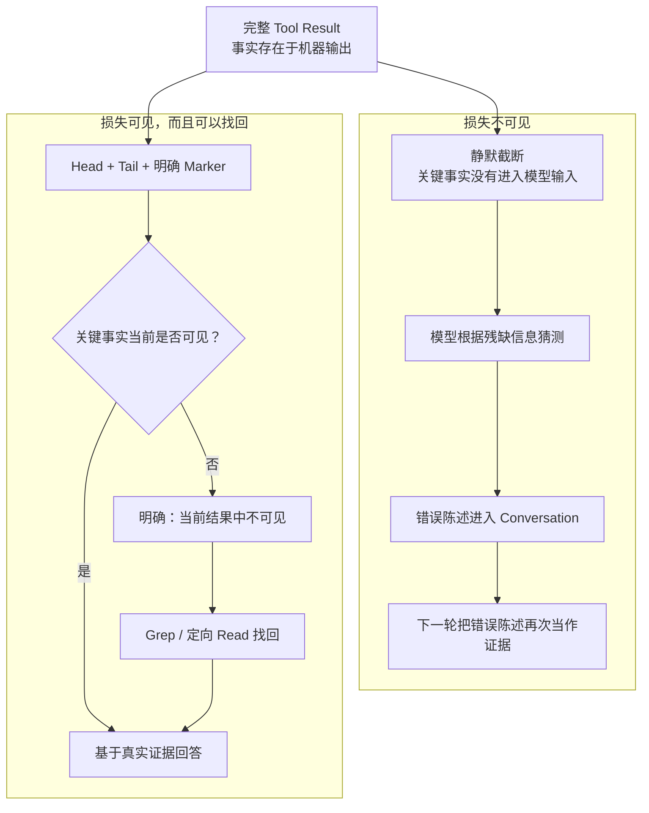

# Content Management：如何为 Coding Agent 管理有限注意力

> 写于 2026-08-13
>
> 这是我从 0 到 1 构建
> [OpenHarness](https://github.com/maisieyang/open-harness)，再连续
> dogfood Plan、Default、Goal、Tool、Compact、Memory、Resume、Skills、Plugins 与
> Subagent 后，对 Content Management 形成的一套工程认知。


一个完整的 Content Management 系统，管理的不只是 Context Window 接近上限时的压缩，而是
信息在 Agent 生命周期中的流动：模型每一轮应该看到什么，Tool Result 以什么形态进入输入，
较早历史如何退出，长期知识如何按需回来，Session 如何恢复，以及父子 Agent 之间继承什么。

这些问题分别对应信息的选择、限流、压缩、外置、恢复与隔离。它们共同决定每一次推理的
Working Set：模型此刻能看到什么、看不到什么，以及可以在什么能力边界内采取行动。

我对这套系统的认知经历了两个阶段：先从第一性原理出发，从 0 到 1 设计信息的载体、生命周期
和边界；再让 Plan、Default、Goal、Tool、Compact、Memory、Resume、Plugin 与 Subagent 进入同一条
dogfood 链路，观察这些选择穿过完整 Agent 生命周期后会暴露什么问题。

这篇文章以系统设计为主线，解释 OpenHarness 如何持续编译下一次推理的 Working Set；最后用
两个真实案例说明，实践如何让我进一步看见确定性信息损失与语义信息损失。


## 起点：Context 不是记忆，而是一次推理的工作集

LLM 的一次 API 调用本身是无状态的。所谓“模型记得之前发生了什么”，只是 Harness 在下一次
调用时，再次提交了相关信息。

这些信息可能来自很多地方：

```text
System Instructions       Project Instructions
Conversation              Tool Results
Goal State                Permission State
Memory Index              Skills
Plugin Capabilities       Available Tools
              \             /
               选择、排序、裁剪、塑形、压缩
                          │
                          ▼
                 本次推理的 Working Set
                          │
                          ▼
                     LLM 判断与行动
```

因此，Context 并不是一个自然存在、不断追加的容器。每次调用模型之前，Harness 都在从不同来源
重新构造它。我更愿意把这个过程理解成：

> Harness 在为下一次推理编译 Working Set。

这个 Working Set 的质量至少有五个维度：

- **充分**：当前判断依赖的事实不能缺失；
- **可信**：事实来源与信息损失边界必须清楚；
- **当前**：最新状态必须能够覆盖已经过时的状态；
- **适配行动**：模型看到的能力应当符合当前模式和权限；
- **足够小**：无关信息不能无限竞争容量与注意力。

这里稀缺的不只是 Token。每个进入输入的 Token 还会竞争模型的注意力、解释权和行动倾向。
旧错误会和最新测试结果竞争解释权；冗长的 Skill description 会和用户任务竞争注意力；Write
是否出现在 Tool catalog 中，则会改变模型对“现在可以做什么”的判断。

更大的 Context Window 可以延后容量耗尽，却不能替 Harness 判断哪些旧状态已经失效、哪些证据
仍然可信、当前应该暴露哪些能力、信息在哪里发生过损失，以及跨过 Session 或 Agent 边界时
究竟应该恢复什么。


## OpenHarness 如何编译下一次 Working Set

从系统视角看，Content Management 不是单个 Compact 功能，而是贯穿 Agent 生命周期的编译
过程。它首先表现为一条不断重新编译输入的主循环：



这张图只描述主循环。Project Memory、Snapshot、Resume 和 Subagent 不是循环之后依次发生的
“第三阶段”：Memory 为未来推理提供新的信息来源；Snapshot 把 Conversation 与控制状态落盘；
Resume 把磁盘状态与当前运行环境重新合并；Subagent 则从一次 ToolUse 分叉出独立 Conversation，
最后把结果送回父循环。

下面分别从三个位置展开这套设计：进入 LLM 前如何选择信息和能力，模型行动后如何控制证据增长，
以及信息跨过 Session 或 Agent 边界时如何保存、恢复与隔离。

### 进入推理前：选择信息，塑造行动空间

#### 选择什么进入 Working Set

一次 Agent 推理所需的信息可以粗略分成三类：

| 信息 | 它回答的问题 | 典型来源 |
|---|---|---|
| 任务 | 现在要完成什么 | 用户消息、Goal、Project Instructions |
| 证据 | 已经知道和验证了什么 | Conversation、Tool Results、Project Memory |
| 能力 | 现在可以采取什么行动 | Tools、Skills、Plugins、Permissions |

这三类信息不能用同一套策略处理。任务约束需要稳定可见；测试结果和错误信息需要保留来源；
能力描述则应该根据当前模式选择。

最直接的方案是把所有可用信息一次性拼进 Prompt。它实现简单，也最大程度避免“模型不知道系统
拥有什么”。但它把发现能力所需的索引和真正执行任务所需的正文混在了一起。能力越多，当前
任务越容易被暂时无关的信息包围。

我选择渐进式暴露：Working Set 先提供短小、可区分的索引，只有模型或用户选择某项能力后，
才加载完整正文。

- Skill catalog 先暴露名称与简短 description，`LoadSkill` 再展开正文；
- Plugin 通过 Skills、Commands、Hooks、Bundles 或 MCP 等 surface 扩展能力，而不是把整个
  Plugin 作为一段文本塞进 Prompt；
- Project Memory 先注入轻量的 `MEMORY.md` 索引，模型需要时再 Read 具体 Memory body。

这个选择减少了常驻 Context，也让能力来源更清楚。代价是模型可能需要多一次读取，Catalog
的名称和 description 也必须足够准确，才能支持正确选择。

#### System Prompt 如何承载这些选择

这些设计最终必须变成模型在本次推理中能够读到的规则。OpenHarness 不把 System Prompt 当作
一段手写后长期不变的说明，而是根据当前环境和能力，按固定结构组装：

```text
Base Instructions
      + Tool Catalog
      + Skill Catalog
      + Environment
      + Project Instructions
      + Memory Rules 与 Index
      + Web Access 状态
      ↓
本次推理使用的 System Prompt
```

稳定、跨项目的行为放在 Base Instructions，例如如何面对 Tool error、如何报告精确验证命令
的结果。具体能力来自当前 Tool 与 Skill catalog；工作目录和运行环境来自 Environment；项目
自己的开发约束来自 Project Instructions；Memory 和 Web 则只在对应能力存在时加入。这种组装
方式让规则的来源和作用范围保持清楚，也避免把所有可能的说明永久塞进每一次输入。

但 System Prompt 只能形成模型应当遵守的语义契约，不能独自承担所有边界：

| 问题 | 由什么负责 |
|---|---|
| 模型应该如何理解任务、选择能力 | System Prompt |
| 模型本轮能够看见哪些信息和 Tool | Context 组装与 Tool registry |
| 一次 Tool 调用是否真的允许执行 | Permission runtime 与 Sandbox |

因此，Prompt 负责告诉模型“应该怎么做”，Harness 代码负责决定“它能看见什么、实际上能做
什么”。Content Management 需要同时设计这两层。


#### Tool surface 如何塑造行动空间

Content Management 从一开始就不只是“模型知道什么”，还包括“模型能做什么”。Tool catalog
本身就是 Context 的一部分。

在 OpenHarness 中，Plan 会把当前 registry 塑形成只读、非委派的 Tool catalog；Write、Edit、
Bash 和 Agent 不进入模型看到的能力面，Permission runtime 还会拒绝伪造或缓存的调用。这里
没有选择在完整能力面上追加一句“请不要修改代码”，因为那会把只读约束变成模型每轮都需要
主动遵守的软建议。

Default、Plan 与 Goal 可以由此统一理解：

| 工作方式 | Working Set 的变化 |
|---|---|
| Default | 当前任务、证据与正常能力面 |
| Plan | 保留探索信息，只暴露只读、非委派能力 |
| Goal | 使用 Default 的工作能力，额外维护完成条件与 Checker feedback |

Goal 没有创造另一套 Agent Loop。工作模型仍然使用同一套工具，直到自然返回不再包含 Tool
Use 的回复；之后独立 Judge 才根据 Goal 与累积证据判断是否继续。Goal 改变的是任务控制信息，
不是一次推理的工具执行协议。

这个设计把 Mode 变成 Working Set 与 action space 的共同变化。它的代价是 Harness 必须保证
Tool catalog、dispatch registry 与 Permission policy 彼此一致，不能只改变模型看到的描述，
却仍然允许隐藏能力在运行时执行。


### 任务运行中：控制证据增长，压缩较早历史

#### 在每个 Tool Result 上控制信息增长

长程 Agent 中，Context 增长最快的部分通常不是用户聊天，而是文件内容、搜索结果、测试日志、
Traceback、网页正文和 Subagent 返回。

因此，信息增长的第一道边界不应该等到最终 Compact，而应该落在每一个 Tool Result。

永远返回完整输出最忠实，却无法控制一次调用对 Context 的占用。只保留头部虽然简单，又会
系统性地丢掉 pytest 汇总、命令退出状态和 Traceback 根因，因为这些信息经常位于结尾。每次都
让另一个 LLM 总结 Tool Result，则会增加延迟、成本和新的语义损失。

我选择为单次结果设置预算，并在结果过长时保留 head + marker + tail：

```text
输出开头
...
[truncated ...]
...
输出结尾
```

开头帮助模型确认命令、目标和输入形态，结尾保留最终结果与错误根因，marker 则明确告诉模型：
这里发生过信息损失。

Marker 不是装饰。没有 marker，模型容易把“这一次 Tool Result 中没有看到”解释成“原始数据
里不存在”。有 marker，模型至少知道自己面对的是不完整证据。

如果真正需要的信息位于被截掉的中段，模型可以按需恢复：

```text
Read：建立文件整体形态
  ↓
发现中段被截断
  ↓
Grep：按名称或 anchor 精确找回事实
```

这个方案主动接受了一个代价：模型有时需要额外调用工具。但它让单次结果体积可控，同时没有
把信息损失伪装成完整证据。

这一层只控制一次 Tool Result 进入 Conversation 时新增多少信息，不处理已经累积的历史，也不
负责判断哪些旧语义应该继续保留。


#### Conversation 过长后，如何划清损失边界

单条 Tool Result 已经受到入口预算控制，Conversation 仍然会随着任务推进持续增长。超过整体
阈值后，OpenHarness 不再按 Tool 名称猜测哪些结果“值得清理”，而是在完整 Conversation 上
同时计算两条 recent 边界：

- Message 维度：最后 N 条 Message，默认 12，可通过
  `OPENHARNESS_COMPACT__PRESERVE_RECENT_MESSAGES` 调整；
- Tool 维度：按 `tool_use_id` 配对后，最近 3 次已经完成的 Tool 交互。

这两个集合不是先后嵌套，而是并行计算后取并集。这样，如果最后 12 条 Message 里包含 5 次
Tool 交互，这 5 次都会原样保留；如果最近 12 条全是普通对话，位于更早位置的最近 3 次 Tool
交互仍然受到保护。

当前完整链路是：

```text
完整请求达到 Compact 输入预算
   ├── recent messages = last N messages（默认 12）
   └── recent tools = last 3 completed tool interactions
        ↓
两个保护集合取并集
        ↓
清理其他已完成 Tool 交互的 Result 正文
   ├── 不区分 Read、Bash、Agent、Web、Plugin 或 MCP
   ├── ToolUse 名称和输入参数继续保留
   └── ToolResult 正文替换为 [cleared]
        ↓
重新估算完整请求
   ├── 已低于阈值：直接使用清理后的 Conversation，不调用 Summary
   └── 仍然超过阈值：切分 cleaned older 与原始 recent messages
        ↓
调用 LLM Summary；Tools=[]；recent messages 不进入本次请求
   ├── 成功：boundary + Summary + 原始 recent messages
   └── PTL、失败、超时或空结果：继续使用清理后的 Conversation
        ↓
发送主模型请求
   ├── Provider 接受：正常推理
   └── Provider 返回 Prompt Too Long
         └── 只允许一次预算驱动的语义重编译
               ├── 最大保留 N 条 recent messages
               ├── 选择预算内不拆散 ToolUse/ToolResult 的最大后缀
               ├── Summary 更早历史，重新应用选择了 rebuild 的动态 Hook
               └── 第二次仍失败：报告 estimate、budget 后显式抛错
```

ToolResult 被清理后，ToolUse 仍然保留。它记录了调用过什么工具、操作了什么对象、使用了哪些
参数。这样，模型知道这项行动已经发生；必要时，也可以据此重新获取当前状态。

清理只作用于已经完成、能够与 ToolUse 配对，并且位于 recent 保护范围之外的 ToolResult。它
不区分内建 Tool、Plugin 或 MCP，也不改写用户消息和 Assistant 结论。

清理后，系统重新估算完整请求。已经低于预算就直接继续；仍然过长，才用 Summary 压缩较早
历史，并原样保留 recent messages。

Prompt Too Long 表示 Provider 明确拒绝了当前请求，原样重试没有意义。主请求遇到它时，系统
只重新编译一次上下文：保留预算内最大的、协议完整的 recent 后缀，把更早历史交给 Summary，
然后重建请求。第二次仍然过长就明确报错，不再继续删除 Conversation。

#### Summary：压缩 older，原样拼回 recent

旧 ToolResult 清理后仍然超过预算，OpenHarness 才进入语义压缩。实现不再抽象讨论哪些信息
“应该”留下，而是先划出一条明确的物理边界：自动 Compact 默认保护最后 12 条 Message；用户
显式执行 `/compact` 时保护最后 2 条。边界以前是 `older`，边界以后是 `recent`。

```text
清理后的 Conversation
        │
        ├── older ──→ 追加专用 Handoff 请求 ──→ LLM Summary
        │                                      Tools = []
        │                                          ↓
        └── 原始 recent ───────────────────────────┐
                                                   ↓
下一次 Conversation = boundary marker + Summary + 原始 recent
```

这里有三项由代码保证。第一，只有 `older` 会发给 Summary 模型；`recent` 从原始 Conversation
直接切出，不经过清理或改写。第二，Summary 调用禁用全部 Tools，并在历史末尾追加一条专用 User
Message，避免模型把任务理解成继续对话。第三，只有拿到非空 Summary 后才替换历史；自动 Compact
失败时继续使用已经完成 ToolResult 清理的 Conversation，显式 `/compact` 失败则报告原因并保持
原 history 不变。

当前 Summary Prompt 把模型设定为下一位 LLM 的任务交接者，要求它输出结构化 Handoff，并保留
当前状态、关键证据、约束、标识与未完成工作。这些栏目和措辞可以继续迭代；真正稳定的设计边界
是：代码决定 `older` 与 `recent`、控制何时允许有损转换并负责重组，LLM 只负责把 `older` 转换
成较短的语义状态。

### 跨越边界：四种机制解决四个问题

信息离开当前 Working Set 以后，并不只有“保存”或“丢失”两种结果。跨越边界时，Harness 还要
回答三个问题：保存到什么保真度，下一次以什么方式取回，以及恢复后谁是当前权威。

OpenHarness 没有用一个统一的 Memory Service 回答所有问题，而是把它拆成 Project Memory、
Snapshot、Resume 和 Subagent。它们分别处理长期知识、精确状态、会话重建和推理隔离。

#### Project Memory：常驻索引，正文按需进入

Project Memory 保存的不是完整 Conversation，而是未来 Session 仍可能有用、又无法从当前代码
和 Git 重新推导的知识，例如用户反馈、协作偏好、项目背景和外部系统入口。

每个项目使用一个由 `cwd` 的绝对路径计算出的独立目录：

```text
~/.openharness/memory/<project-name>-<cwd-hash>/
├── MEMORY.md          # 轻量索引
├── feedback-a.md      # 独立 Memory 正文
└── project-b.md
```

启用 Memory 且 System Prompt 没有被 Bundle 完全替换时，OpenHarness 会在每轮推理前重新读取
`MEMORY.md`，最多取前 200 行，与 Memory 使用规则一起放进 System Prompt。具体 Memory 正文
不会被自动注入，也没有生产路径上的关键词排序器替模型选择。模型先看见一行式索引，判断某项
可能相关后，再通过 `Read` 加载对应文件：

```text
MEMORY.md 索引进入 System Prompt
              ↓
模型判断某项 Memory 是否相关
          ├── 否：不支付正文 Token
          └── 是：Read 对应 .md 正文
```

写入也由模型通过普通工具完成，而不是在每轮结束后由 Harness 自动抽取。当前 Prompt 规定两步
协议：先用 `Write` 创建或更新独立 Memory 文件，再用 `Edit` 给 `MEMORY.md` 增加一行入口。
索引负责发现，正文负责承载细节；旧内容需要由模型更新或删除。

这个设计的核心取舍是渐进式暴露。它避免所有长期知识永久占用 Context，却把索引质量和读取
决策交给了模型。Memory 也不能直接覆盖当前证据：如果记忆与代码、测试或外部系统的当前状态
冲突，应以重新观察到的事实为准，并更新过时 Memory。

#### Snapshot：保存能够精确恢复的 Session 状态

Snapshot 解决的不是“未来值得记住什么”，而是“进程现在退出，怎样让这段 Session 继续”。
因此它不能把状态改写成自然语言摘要，而要保留协议结构。

OpenHarness 在每个 Agent turn 的终止路径上，把状态序列化成版本化 JSON。Conversation 中的
`TextBlock`、`ToolUseBlock` 和 `ToolResultBlock` 都保留类型标识；同时保存模型参数、Tool
metadata、Permission profile 指纹，以及可恢复的 Permission runtime 状态。JSON 位于另一个
按 `cwd` 隔离的目录：

```text
~/.openharness/snapshots/<project-name>-<cwd-hash>/
├── current.json       # 当前 Session 的最新状态
└── history/           # 被下一次写入轮换下来的旧版本
```

写入使用同目录临时文件加原子替换。覆盖前先读出旧 `current.json`，新的 current 原子生效后，
再把旧内容写入 `history/`；轮换默认最多保留 100 份、90 天。Snapshot 写入失败只记录 warning，
不让已经完成的 Agent turn 变成失败。

`/clear` 也因此不是只执行一次 `history = []`。它会清空 REPL 内存中的 Conversation 和 pending
Permission state，再原子地把磁盘 `current.json` 替换成零消息状态。否则进程退出后，
`--resume` 仍会把已经 Clear 的旧 Conversation 带回来。

#### Resume：用磁盘历史与当前运行时重新组装 Session

Snapshot 是存储格式，Resume 是恢复策略。恢复不能简单选择“完全相信磁盘”或“完全重新开始”，
因为历史事实和当前能力的权威来源不同。

公开 REPL 的 `oh --resume` 先按当前配置建立 Tool registry、Skills、Plugins、Project
Instructions、Sandbox 和 Permission profile，再读取当前项目的 Snapshot。加载时会拒绝 cwd
不匹配、无法解析或版本过新的文件；Git HEAD 变化只产生 warning，因为代码变化值得提醒，却
不必自动抹掉会话。

恢复时，两类信息在边界处汇合：

| 来自 Snapshot | 来自当前运行环境 |
|---|---|
| typed Conversation | Tool 与 MCP registry |
| parked Permission continuation | Skills、Plugins 与 Project Instructions |
| Goal 的 transcript sentinels | 当前 System Prompt 与 Memory Index |
| 已发生的 ToolUse/ToolResult | Sandbox、Permission profile 与执行边界 |

Permission runtime 只有在 Snapshot 中保存的 profile 指纹与当前 canonical profile 一致时才能
恢复；Active Goal 则从 Conversation 里的 `set`、`met`、`cleared` sentinels 重建。下一轮使用的
System Prompt 和能力面仍按当前环境重新编译，而不是让旧 Snapshot 永久覆盖新配置。

所以 Resume 的本质不是“把 JSON 塞回 Prompt”，而是一次带权威边界的状态合并：过去发生过
什么由 Snapshot 提供，现在能够做什么由当前运行时决定。

#### Subagent：隔离 Conversation，继承运行时

Subagent 解决的是同一 Session 内的另一种边界：怎样让一段多步调查拥有自己的注意力空间，
又不把全部内部过程写回父 Conversation。

在实现上，`Agent` 只是一个普通 Tool。父模型调用它时提供 `description` 和一段完整 `prompt`；
`SpawnAgent.execute()` 通过 `dataclasses.replace()` 从父 `QueryContext` 构造子 Context，并把
`agent_depth` 加一。子 Agent 默认继承父级的模型、System Prompt、Tool registry、Skills、cwd、
Hooks、Memory、Sandbox、Permission runtime 和授权上下文，但它不继承父 Conversation：

```text
父 Agent：Agent(prompt=完整子任务)
                ↓
继承运行时能力与安全边界
                +
新的 Conversation = [这条子任务]
                ↓
子 Agent 独立运行同一个 Agent Loop
                ↓
最终文本成为一个 Agent ToolResult
                ↓
父 Conversation 只增长一组 ToolUse + ToolResult
```

因此，这里的“隔离”必须准确理解为 Conversation 隔离，而不是最小权限隔离。当前默认 Subagent
拥有与父 Agent 相同的 Tool surface；构造器虽然预留了 `tool_filter`，生产实现并未应用它。
递归只由 `max_agent_depth` 限制，默认最多 3 层。

这个选择显著减少了父 Conversation 的增长，也避免子任务被父历史中的旧错误和无关讨论干扰。
代价是父 Agent 必须把目标、约束和必要背景写进那条 `prompt`；父级最终只看见子 Agent 的结论，
而看不见它内部完整的 Conversation 与 Tool 轨迹。

四个机制由此形成了清晰分工：Project Memory 决定哪些知识值得跨 Session 存活，Snapshot 决定
哪些状态必须精确落盘，Resume 决定旧状态如何与当前能力合并，Subagent 决定一次推理分支应当
继承什么、隔离什么。它们都在管理信息如何跨过边界，但对保真度、权威来源和重新进入 Context
的方式作出了不同选择。


## 两个 Dogfood Case：设计在哪些接缝处失效

单元测试可以证明每个函数满足自己的 contract，却不能保证信息走完整条链路后，模型看到的
仍然是我以为它会看到的东西。下面只保留两个真正改变我判断的案例：一个是确定性的信息损失，
另一个是 Summary 引入的语义损失。


### Case 1：信息存在，不等于模型看见

**我最初的选择**：给每个 Tool Result 设置预算。我的出发点很直接：一条测试日志或文件内容
不能占满整个 Context。

**Dogfood 让我看见**：一次完整 pytest 已经在终端产生结果，但末尾统计没有进入模型看到的
Tool Result。模型看不到真实数字，却在回复中给出了推测结果。这个错误数字随后进入
Conversation，下一轮反而成了更容易引用的“证据”。

**这改变了我的判断**：信息没有从机器上消失，不代表它参与了这一次推理。限流不是单纯控制
长度，而是在设计证据以什么方式损失。模型生成的错误陈述一旦进入 Conversation，还可能比
被截掉的真实证据拥有更强的后续影响力。



**我最后怎么改**：Tool Result 保留 head、tail 与明确的截断 marker；Prompt 要求模型区分
“当前结果中不可见”和“原始数据中不存在”。关键事实位于中段时，再用 Grep 或定向 Read
找回。限流不再假装没有损失，而是把损失本身变成模型可见的事实。


### Case 2：事实还在，不等于 Handoff 正确

**我最初的理解**：Summary 就是给 LLM 一段 Prompt，让它把较早 Conversation 压缩成结构化
文本，再与原始 recent tail 一起交给后续模型。

**Dogfood 让我看见**：Summary 有时保留了 Skill 内容，却改变了它的来源——用户显式选择的
Slash Skill 被描述成模型主动调用了 `LoadSkill`；较早错误会被写成最新错误，已经解决的任务
会重新变成当前待办；总结请求本身也曾被误认为用户任务。文字仍然通顺，关键词也还存在，但
provenance、时间顺序和当前状态已经改变。

**我的第一次修正**，是给 Summary Prompt 加入更严格的结构和更多保真规则，再用 Eval 检查
这些事实是否存活。它解决了一部分缺陷，却也让 Prompt 越来越像 Conversation 归档模板，而
不是交给下一位模型的工作状态。要求复述更多内容，不一定带来更好的延续。

**这再次改变了我的判断**：Summary 的目标不是保留尽可能多的句子，而是完成可靠的任务交接。
来源、顺序、最新状态和未完成工作不是附属元数据，而是后续决策直接依赖的事实。

**我最后怎么改**：Summary Prompt 只追问接手者继续工作所需的最小状态，并在历史末尾追加一条
专用请求，明确要求生成 Handoff，而不是续写上面的对话。确定性代码负责划定 older 与 recent，
Summary 负责语义选择；`memory_compact` Eval 则分别检查最新状态、Skill provenance 和错误顺序
能否在转换后继续成立。


## 这些边界如何验证

Content Management 同时包含确定性状态转换、模型生成行为和跨模块生命周期，三者不能用同一种
测试证明。

| 验证层 | 回答的问题 | 典型对象 |
|---|---|---|
| TDD | 结构和状态转换是否正确 | ToolUse/ToolResult 配对、预算、recent 边界、Snapshot |
| Capability Eval | 模型的语义转换是否达到契约 | Summary 的当前状态、provenance、错误顺序 |
| Dogfood | 信息走完整生命周期后是否仍然成立 | Tool 截断、Compact、Resume、Permission 的组合链路 |

TDD 不能证明 Summary 质量，有限 Eval 不能证明所有长对话，Dogfood 也不能替代可重复回归。它们
分别守住代码硬机制、Prompt 软契约和跨层接缝。


## 充分利用有限输入，不是塞得更多

随着模型的 Context Window 从几万增长到几十万，甚至继续扩大，Content Management 不会因此
消失。

因为它解决的不只是容量：旧状态仍然会过时，错误证据仍然会竞争解释权，无关能力仍然会干扰
行动选择，长 Tool Result 仍然会稀释最终结论，Resume 仍然需要权威状态，Subagent 仍然需要
隔离，有损 Summary 仍然需要保真契约。

从 0 到 1 设计这个系统，让我看见 Content Management 的完整地图；让系统真正运行起来，则
让我看见地图上最容易被忽略的接缝。前者决定系统由什么组成，后者决定这些组成部分是否真的能
在现实中共同工作。

Harness 的职责不是替模型决定每一步应该怎么思考，而是持续为下一次思考准备正确条件。

> 充分利用 LLM 有限的输入，不是把尽可能多的过去交给模型，而是为每一次判断编译一个足够、
> 可信、当前、适配行动，并且清楚标明未知边界的 Working Set。
