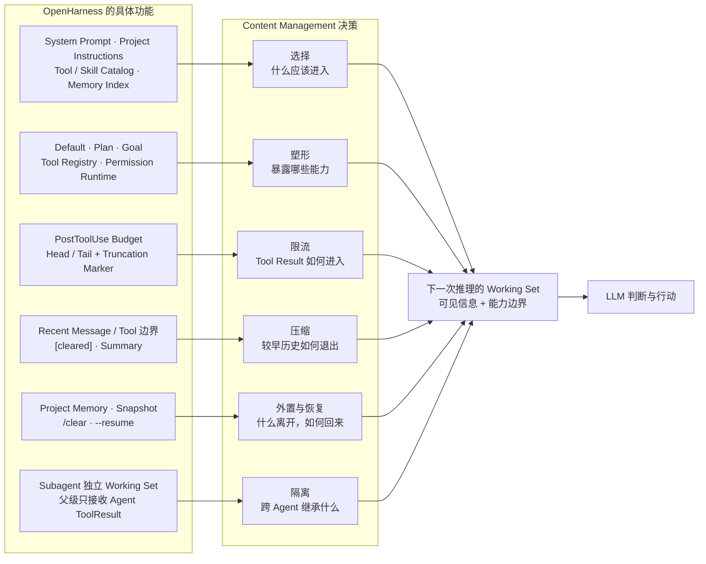
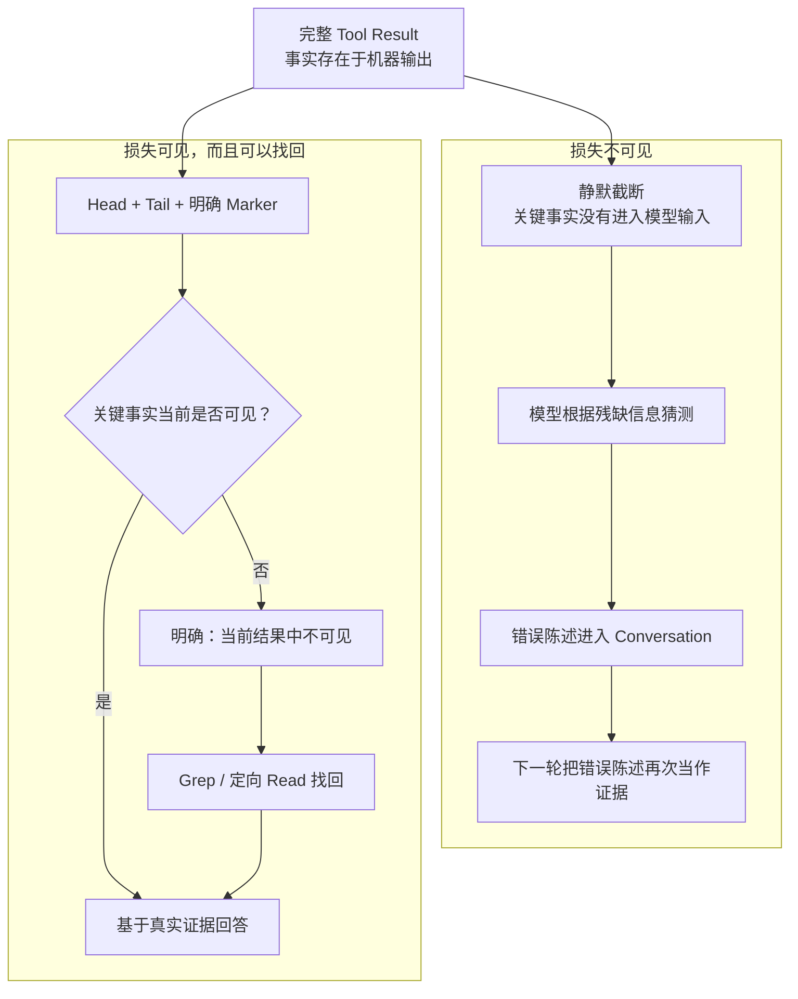

# Content Management：如何为 Coding Agent 管理有限注意力

> 写于 2026-08-13
>
> 这是我从 0 到 1 构建
> [build-my-own-harness](https://github.com/maisieyang/build-my-own-harness)，再连续
> dogfood Plan、Default、Goal、Tool、Compact、Memory、Resume、Skills、Plugins 与
> Subagent 后，对 Content Management 形成的一套工程认知。


## 两轮认知：先设计系统，再让系统接受反馈

一个完整的 Content Management 系统，管理的不只是 Context Window 接近上限时的压缩，而是
信息在 Agent 生命周期中的流动：模型每一轮应该看到什么，Tool Result 以什么形态进入输入，
较早历史如何退出，长期知识如何按需回来，Session 如何恢复，以及父子 Agent 之间继承什么。

这些问题分别对应信息的选择、限流、压缩、外置、恢复与隔离。它们共同决定每一次推理的
Working Set：模型此刻能看到什么、看不到什么，以及可以在什么能力边界内采取行动。

我对这套系统的认知经历了两个阶段。

第一阶段，是从 0 到 1 设计系统。我从第一性原理拆分问题，为不同信息选择载体、生命周期和
边界。这个阶段已经形成了 Content Management 的整体架构；每个选择都是一个假设，也意味着
我主动放弃了其他方案，并接受相应的代价。

第二阶段，是让系统真正跑起来。当 Plan、Goal、Tool、Compact、Memory、Resume、Plugin 和
Subagent 进入同一条 dogfood 链路，许多单个模块无法暴露的接缝开始出现。Dogfood 让我看见，
第一阶段的每个架构选择，只有穿过完整的 Agent 生命周期，才会暴露真正需要守住的边界。

整个过程可以概括为：

```text
第一性原理
    ↓
架构选择
    ↓
可运行系统
    ↓
Dogfood 反馈
    ↓
修正实现与认知
    ↓
沉淀为测试、Eval 与工程契约
```

设计给出系统的完整性，dogfood 给出系统的真实性。本文先说明这些架构选择如何形成，再说明
真实运行如何检验并修正它们。


## 起点：Context 不是记忆，而是一次推理的工作集

LLM 的一次 API 调用本身是无状态的。所谓“模型记得之前发生了什么”，只是 Harness 在下一次
调用时，再次提交了相关信息。

这些信息可能来自很多地方：

```text
System Instructions       Project Instructions
Conversation              Tool Results
Goal State                Permission State
Memory Index              Skills
Plugin Capabilities       Available Tools
              \             /
               选择、排序、裁剪、塑形、压缩
                          │
                          ▼
                 本次推理的 Working Set
                          │
                          ▼
                     LLM 判断与行动
```

因此，Context 并不是一个自然存在、不断追加的容器。每次调用模型之前，Harness 都在从不同来源
重新构造它。我更愿意把这个过程理解成：

> Harness 在为下一次推理编译 Working Set。

这个 Working Set 的质量至少有五个维度：

- **充分**：当前判断依赖的事实不能缺失；
- **可信**：事实来源与信息损失边界必须清楚；
- **当前**：最新状态必须能够覆盖已经过时的状态；
- **适配行动**：模型看到的能力应当符合当前模式和权限；
- **足够小**：无关信息不能无限竞争容量与注意力。

这里稀缺的不只是 Token。每个进入输入的 Token 还会竞争模型的注意力、解释权和行动倾向。
旧错误会和最新测试结果竞争解释权；冗长的 Skill description 会和用户任务竞争注意力；Write
是否出现在 Tool catalog 中，则会改变模型对“现在可以做什么”的判断。

更大的 Context Window 可以延后容量耗尽，却不能替 Harness 判断哪些旧状态已经失效、哪些证据
仍然可信、当前应该暴露哪些能力、信息在哪里发生过损失，以及跨过 Session 或 Agent 边界时
究竟应该恢复什么。


## 第一部分：从 0 到 1 设计 Content Management 系统

从系统视角看，Content Management 不是单个 Compact 功能，而是一条完整的信息生命周期：

```text
不同信息来源 ──→ 编译 Working Set ──→ LLM 判断
                                             ↓
                              Assistant Message 进入 Conversation
                              ├── 不含 ToolUse ──→ 直接回复 ──→ 当前 Agent Loop 结束
                              └── 含 ToolUse ──→ 执行 Tool
                                                     ↓
                                              Raw Tool Result
                                                     ↓
                                              入口预算与截断
                                                     ↓
                                      ToolResult 进入 Conversation
                                                     ↓
                                         编译下一次 Working Set
                                                     ↓
                                                 LLM 判断

Conversation 持续增长
      ↓
完整请求接近输入预算
      ↓
管理历史信息
  ├── 清理旧 ToolResult
  ├── 必要时 Summary 较早 Conversation
  └── 原样保留 recent Context
      ↓
重新编译 Working Set

Prompt 之外
      ├── Project Memory：跨 Session 的长期知识
      ├── Snapshot：当前 Session 的恢复状态
      └── Subagent：为子任务重新构造的隔离 Context
```

沿着这条生命周期，我连续做出了六组设计选择。


### 1. 先决定什么进入 Working Set

一次 Agent 推理所需的信息可以粗略分成三类：

| 信息 | 它回答的问题 | 典型来源 |
|---|---|---|
| 任务 | 现在要完成什么 | 用户消息、Goal、Project Instructions |
| 证据 | 已经知道和验证了什么 | Conversation、Tool Results、Project Memory |
| 能力 | 现在可以采取什么行动 | Tools、Skills、Plugins、Permissions |

这三类信息不能用同一套策略处理。任务约束需要稳定可见；测试结果和错误信息需要保留来源；
能力描述则应该根据当前模式选择。

最直接的方案是把所有可用信息一次性拼进 Prompt。它实现简单，也最大程度避免“模型不知道系统
拥有什么”。但它把发现能力所需的索引和真正执行任务所需的正文混在了一起。能力越多，当前
任务越容易被暂时无关的信息包围。

我选择渐进式暴露：Working Set 先提供短小、可区分的索引，只有模型或用户选择某项能力后，
才加载完整正文。

- Skill catalog 先暴露名称与简短 description，`LoadSkill` 再展开正文；
- Plugin 通过 Skills、Commands、Hooks、Bundles 或 MCP 等 surface 扩展能力，而不是把整个
  Plugin 作为一段文本塞进 Prompt；
- Project Memory 先注入轻量的 `MEMORY.md` 索引，模型需要时再 Read 具体 Memory body。

这个选择减少了常驻 Context，也让能力来源更清楚。代价是模型可能需要多一次读取，Catalog
的名称和 description 也必须足够准确，才能支持正确选择。

#### System Prompt 如何承载这些选择

这些设计最终必须变成模型在本次推理中能够读到的规则。OpenHarness 不把 System Prompt 当作
一段手写后长期不变的说明，而是根据当前环境和能力，按固定结构组装：

```text
Base Instructions
      + Tool Catalog
      + Skill Catalog
      + Environment
      + Project Instructions
      + Memory Rules 与 Index
      + Web Access 状态
      ↓
本次推理使用的 System Prompt
```

稳定、跨项目的行为放在 Base Instructions，例如如何面对 Tool error、如何报告精确验证命令
的结果。具体能力来自当前 Tool 与 Skill catalog；工作目录和运行环境来自 Environment；项目
自己的开发约束来自 Project Instructions；Memory 和 Web 则只在对应能力存在时加入。这种组装
方式让规则的来源和作用范围保持清楚，也避免把所有可能的说明永久塞进每一次输入。

但 System Prompt 只能形成模型应当遵守的语义契约，不能独自承担所有边界：

| 问题 | 由什么负责 |
|---|---|
| 模型应该如何理解任务、选择能力 | System Prompt |
| 模型本轮能够看见哪些信息和 Tool | Context 组装与 Tool registry |
| 一次 Tool 调用是否真的允许执行 | Permission runtime 与 Sandbox |

因此，Prompt 负责告诉模型“应该怎么做”，Harness 代码负责决定“它能看见什么、实际上能做
什么”。Content Management 需要同时设计这两层。


### 2. 不只管理信息，还要塑造行动空间

Content Management 从一开始就不只是“模型知道什么”，还包括“模型能做什么”。Tool catalog
本身就是 Context 的一部分。

在 OpenHarness 中，Plan 会把当前 registry 塑形成只读、非委派的 Tool catalog；Write、Edit、
Bash 和 Agent 不进入模型看到的能力面，Permission runtime 还会拒绝伪造或缓存的调用。这里
没有选择在完整能力面上追加一句“请不要修改代码”，因为那会把只读约束变成模型每轮都需要
主动遵守的软建议。

Default、Plan 与 Goal 可以由此统一理解：

| 工作方式 | Working Set 的变化 |
|---|---|
| Default | 当前任务、证据与正常能力面 |
| Plan | 保留探索信息，只暴露只读、非委派能力 |
| Goal | 使用 Default 的工作能力，额外维护完成条件与 Checker feedback |

Goal 没有创造另一套 Agent Loop。工作模型仍然使用同一套工具，直到自然返回不再包含 Tool
Use 的回复；之后独立 Judge 才根据 Goal 与累积证据判断是否继续。Goal 改变的是任务控制信息，
不是一次推理的工具执行协议。

这个设计把 Mode 变成 Working Set 与 action space 的共同变化。它的代价是 Harness 必须保证
Tool catalog、dispatch registry 与 Permission policy 彼此一致，不能只改变模型看到的描述，
却仍然允许隐藏能力在运行时执行。


### 3. 在每个 Tool Result 上控制信息增长

长程 Agent 中，Context 增长最快的部分通常不是用户聊天，而是文件内容、搜索结果、测试日志、
Traceback、网页正文和 Subagent 返回。

因此，信息增长的第一道边界不应该等到最终 Compact，而应该落在每一个 Tool Result。

永远返回完整输出最忠实，却无法控制一次调用对 Context 的占用。只保留头部虽然简单，又会
系统性地丢掉 pytest 汇总、命令退出状态和 Traceback 根因，因为这些信息经常位于结尾。每次都
让另一个 LLM 总结 Tool Result，则会增加延迟、成本和新的语义损失。

我选择为单次结果设置预算，并在结果过长时保留 head + marker + tail：

```text
输出开头
...
[truncated ...]
...
输出结尾
```

开头帮助模型确认命令、目标和输入形态，结尾保留最终结果与错误根因，marker 则明确告诉模型：
这里发生过信息损失。

Marker 不是装饰。没有 marker，模型容易把“这一次 Tool Result 中没有看到”解释成“原始数据
里不存在”。有 marker，模型至少知道自己面对的是不完整证据。

如果真正需要的信息位于被截掉的中段，模型可以按需恢复：

```text
Read：建立文件整体形态
  ↓
发现中段被截断
  ↓
Grep：按名称或 anchor 精确找回事实
```

这个方案主动接受了一个代价：模型有时需要额外调用工具。但它让单次结果体积可控，同时没有
把信息损失伪装成完整证据。

这一层只控制一次 Tool Result 进入 Conversation 时新增多少信息，不处理已经累积的历史，也不
负责判断哪些旧语义应该继续保留。


### 4. Conversation 过长后，如何在损失发生前划清边界

单条 Tool Result 已经受到入口预算控制，Conversation 仍然会随着任务推进持续增长。超过整体
阈值后，OpenHarness 不再按 Tool 名称猜测哪些结果“值得清理”，而是在完整 Conversation 上
同时计算两条 recent 边界：

- Message 维度：最后 N 条 Message，默认 12，可通过
  `OPENHARNESS_COMPACT__PRESERVE_RECENT_MESSAGES` 调整；
- Tool 维度：按 `tool_use_id` 配对后，最近 3 次已经完成的 Tool 交互。

这两个集合不是先后嵌套，而是并行计算后取并集。这样，如果最后 12 条 Message 里包含 5 次
Tool 交互，这 5 次都会原样保留；如果最近 12 条全是普通对话，位于更早位置的最近 3 次 Tool
交互仍然受到保护。

当前完整链路是：

```text
完整请求达到 Compact 输入预算
   ├── recent messages = last N messages（默认 12）
   └── recent tools = last 3 completed tool interactions
        ↓
两个保护集合取并集
        ↓
清理其他已完成 Tool 交互的 Result 正文
   ├── 不区分 Read、Bash、Agent、Web、Plugin 或 MCP
   ├── ToolUse 名称和输入参数继续保留
   └── ToolResult 正文替换为 [cleared]
        ↓
重新估算完整请求
   ├── 已低于阈值：直接使用清理后的 Conversation，不调用 Summary
   └── 仍然超过阈值：切分 cleaned older 与原始 recent messages
        ↓
调用 LLM Summary；Tools=[]；recent messages 不进入本次请求
   ├── 成功：boundary + Summary + 原始 recent messages
   └── PTL、失败、超时或空结果：继续使用清理后的 Conversation
        ↓
发送主模型请求
   ├── Provider 接受：正常推理
   └── Provider 返回 Prompt Too Long
         └── 只允许一次预算驱动的语义重编译
               ├── 最大保留 N 条 recent messages
               ├── 选择预算内不拆散 ToolUse/ToolResult 的最大后缀
               ├── Summary 更早历史，重新应用选择了 rebuild 的动态 Hook
               └── 第二次仍失败：报告 estimate、budget 后显式抛错
```

ToolResult 被清理后，ToolUse 仍然保留。它记录了调用过什么工具、操作了什么对象、使用了哪些
参数。这样，模型知道这项行动已经发生；必要时，也可以据此重新获取当前状态。

清理只作用于已经完成、能够与 ToolUse 配对，并且位于 recent 保护范围之外的 ToolResult。它
不区分内建 Tool、Plugin 或 MCP，也不改写用户消息和 Assistant 结论。

清理后，系统重新估算完整请求。已经低于预算就直接继续；仍然过长，才用 Summary 压缩较早
历史，并原样保留 recent messages。

Prompt Too Long 表示 Provider 明确拒绝了当前请求，原样重试没有意义。主请求遇到它时，系统
只重新编译一次上下文：保留预算内最大的、协议完整的 recent 后缀，把更早历史交给 Summary，
然后重建请求。第二次仍然过长就明确报错，不再继续删除 Conversation。

#### Summary 要为下一次推理留下什么

Conversation 是一条按时间增长的事件流，Summary 却不应该成为它的缩写版。它真正要回答的
只有一个问题：

> 当较早历史退出输入后，下一次推理还必须知道什么，才能继续工作，而不重复已经完成的事情、
> 不误判当前状态，也不操作错对象？

这个问题通常落到三类信息：当前目标与约束，已经验证的当前状态，以及仍未完成的工作。

### 5. 把长期知识与精确恢复放在 Prompt 之外

不是所有需要保存的信息都应该永久进入 Prompt。长期知识与 Session 恢复尤其需要离开当前
Working Set，但它们解决的不是同一个问题。

Project Memory 回答的是：哪些知识在未来 Session 中可能再次有用？它允许模型持续整理内容，
通过轻量索引发现，再按需读取具体正文。它追求长期相关性，不保存每一轮对话顺序。

Snapshot 回答的是：如果当前进程退出，怎样恢复这段 Session？它需要保留 Conversation 的
typed blocks、Goal 状态和 Permission continuation 等可恢复状态，不能让 LLM 自由改写。

我没有把两者收进一个模糊的 Memory Service。一个允许语义整理，一个要求结构保真；一个服务
跨 Session 知识复用，一个服务当前 Session 的精确恢复。统一文件格式或接口不会消除这种职责
差异，只会隐藏冲突。

Resume 也不是把磁盘 JSON 原样塞回 Prompt。恢复时，历史消息来自 Snapshot，当前 Tool
registry、Plugin 开关、Skills、Project Instructions 和 Permission boundary 则由当前运行环境
重新建立。不兼容的 Permission profile 不能静默沿用。

所以 Resume 的本质是：

```text
历史 Session 状态
        +
当前运行环境与能力边界
        ↓
重新编译下一次 Working Set
```

这个设计比“保存一段自然语言摘要，下次告诉模型继续”更复杂，但它保留了 ToolUse、ToolResult
和控制状态之间的协议关系。


### 6. 隔离也是 Content Management

信息不应该进入当前 Prompt，同样不意味着它可以无条件跨过其他边界。

Plugin 启用后，只通过明确的能力 surface 改变系统；未启用的 Plugin 不进入当前能力面。
Namespaced Skills 保留来源，避免多个 Plugin 对同名能力产生歧义。

Subagent 也不机械继承父 Agent 的完整 Conversation。子任务通常只需要明确目标、必要事实、
相关文件和合适工具。复制父历史会同时带入无关争论、旧错误和不属于子任务的行动倾向。

我选择让 Subagent 使用独立 Working Set，父 Agent 只接收最终 Agent Tool Result。代价是父级
必须明确交接目标与必要背景；收益是子任务的注意力更集中，内部消息和 Tool 调用也不会无条件
膨胀父 Conversation。

到这里，设计阶段的完整地图已经形成：选择、塑形、限流、压缩、外置和隔离共同管理一次推理
真正可见的信息。




## 第二部分：系统跑起来以后，我在 Dogfood 中看见了什么

设计阶段给出的仍然是我的架构假设。单元测试可以证明每个函数满足自己的 contract，却不能
保证信息走完整条链路后，模型看到的仍然是我以为它会看到的东西。

Dogfood 的价值，就在于让这些假设进入真实生命周期。它既会发现缺陷，也会证明某些设计确实
成立。这里记录的不只是手动会话里直接看见的现象，也包括沿着这些现象继续检查源码、重构系统
后形成的新认识。


### 1. 信息存在，不等于模型看见

**我最初的选择**：给每个 Tool Result 设置预算。我的出发点很直接：一条测试日志或文件内容
不能占满整个 Context。

**Dogfood 让我看见**：一次完整 pytest 已经在终端产生结果，但末尾统计没有进入模型看到的
Tool Result。模型看不到真实数字，却在回复中给出了推测结果。这个错误数字随后进入
Conversation，下一轮反而成了更容易引用的“证据”。

**这改变了我的判断**：信息没有从机器上消失，不代表它参与了这一次推理。限流不是单纯控制
长度，而是在设计证据以什么方式损失。模型生成的错误陈述一旦进入 Conversation，还可能比
被截掉的真实证据拥有更强的后续影响力。



**我最后怎么改**：Tool Result 保留 head、tail 与明确的截断 marker；Prompt 要求模型区分
“当前结果中不可见”和“原始数据中不存在”。关键事实位于中段时，再用 Grep 或定向 Read
找回。限流不再假装没有损失，而是把损失本身变成模型可见的事实。


### 2. Conversation 没有超限，不等于请求放得下

**我最初的选择**：用 Conversation 的 Token 数决定何时 Compact。它是增长最快的部分，也最
容易被测量。

**继续向下追以后，我看见**：Provider 接收的并不只有 Conversation。System Prompt、Project
Instructions、Tool 与 MCP schemas、输出 Token 预留，以及 Hook 动态加入的内容，都共享同一个
Context Window。只计算 Conversation，会让本地判断“还能放下”的请求被 Provider 直接拒绝。

**这改变了我的判断**：容量属于完整请求，不属于某一种消息来源。随着 MCP 和 Plugin 增加，
能力描述本身也会成为主要 Context 成本。

**我最后怎么改**：系统先编译包含 System Prompt、Tool schemas 与 Conversation 的请求草稿，
扣除输出预留后决定是否清理或 Summary。PreApiCall Hook 随后仍可能改变实际请求；如果
Provider 返回 Prompt Too Long，恢复逻辑会根据这份被拒请求的实际开销只做一次语义重编译，
并重新应用明确选择了 rebuild 的动态 Hook。第二次仍失败就报告预算诊断并显式结束，不在重试
循环里盲删 Conversation。


### 3. 事实还在，不等于 Handoff 仍然正确

**我最初的理解**：Summary 就是给 LLM 一段 Prompt，让它把较早 Conversation 压缩成结构化
文本，再与原始 recent tail 一起交给后续模型。

**Dogfood 让我看见**：Summary 有时保留了 Skill 内容，却改变了它的来源——用户显式选择的
Slash Skill 被描述成模型主动调用了 `LoadSkill`；较早错误会被写成最新错误，已经解决的任务
会重新变成当前待办；总结请求本身也曾被误认为用户任务。文字仍然通顺，关键词也还存在，但
provenance、时间顺序和当前状态已经改变。

**我的第一次修正**，是给 Summary Prompt 加入更严格的结构和更多保真规则：明确 provenance、
错误顺序、最新状态、路径、命令和 ID，再用 Eval 检查这些事实是否存活。这解决了一部分真实
缺陷，但也让我逐渐看见另一个问题：Prompt 越来越像一份 Conversation 归档模板，而不是交给
下一位模型的工作状态。要求复述更多栏目，不一定带来更好的延续，反而会让旧历史和 Summary
请求本身继续竞争“当前工作”的位置。

**这再次改变了我的判断**：Summary 的目标不是“保留尽可能多的句子”，而是为下一位模型生成
可靠的任务交接。来源、顺序、最新状态和未完成工作不是附属元数据，而是后续决策直接依赖的
事实；Prompt 的结构本身也会决定模型把什么当作重要信息。

**我最后怎么改**：Compact Prompt 收敛为六段 Handoff：Current Objective、Current State、
Verified Evidence、Decisions and Constraints、Active Artifacts、Remaining Work。专用 User
Message 明确要求生成交接状态而不是续写对话，Summary 调用禁用 Tools；确定性代码只清理
保护范围外的旧 ToolResult，不改写用户消息、Assistant 结论和 recent tail。

这些语义决策面由 `memory_compact` Eval 验证。由于基础 Prompt 已改变，旧 cassette 不再能
证明当前行为；10 个 cases 必须重新完成 live、record 与 replay，才能建立新的可信基线。
即使全部通过，也只证明已定义决策面，而不是任意 Conversation 都能被可靠压缩。

### 4. Conversation 不是 Session 的全部状态

**我最初的实现**：Snapshot 主要恢复 Conversation；`/clear` 清空内存中的消息。权限请求暂停
后，用户的批准或拒绝则被包装成一条 synthetic 用户消息，再交给模型决定如何继续。

**Dogfood 让我看见**：`/clear` 后退出再 Resume，磁盘 Snapshot 会让旧消息重新出现；审批链路
中的 synthetic 消息也不是真正的 continuation。它既伪造了用户没有说过的内容，也丢失了一次
多 Tool 调用具体停在哪里、哪些结果已经完成等控制状态。

**这改变了我的判断**：Session 不只有 Conversation。Active Goal、parked Permission、Tool
batch 的中断位置，以及“这段历史已经被 Clear”本身，都是需要保存和恢复的状态；但这些状态
不应该为了让模型看见而被伪装成对话消息。

**我最后怎么改**：Snapshot 保存 typed Conversation 与可恢复控制状态；`/clear` 同时清空内存
状态并原子替换磁盘 Snapshot。Permission 使用独立 parked continuation 保存 exact request、
已完成结果和 controller 状态，`/approve` 或 `/deny` 直接接回原 Agent Loop，不再向
Conversation 插入 synthetic 用户消息。


## 第三部分：把反馈重新编译成工程认知

Dogfood 没有推翻我的全部设计。许多第一性原理选择被证明是正确方向，真实使用则进一步告诉
我，这些方向必须精确到什么程度。

| 设计阶段已经形成的判断 | Dogfood 后加深的认识 |
|---|---|
| Tool Result 必须限流 | 限流还必须让模型知道证据在哪里发生了损失 |
| Conversation 需要容量预算 | 真正共享 Context Window 的是完整 Provider 请求 |
| Summary Prompt 必须保留关键事实 | Summary 是任务 Handoff；来源、顺序与当前状态需要独立 Eval |
| Snapshot 负责 Resume | Session 还包含 Goal、Permission continuation 等非对话状态 |

这张变化表揭示了我的两轮认知如何接在一起：设计负责提出可组合的系统假设，dogfood 负责让
这些假设面对完整生命周期。反馈最终不应该只停留在一次修复里，还需要进入可重复执行的验证
体系。


### TDD 守确定性不变量

可以精确定义的行为由测试直接约束：

- Tool Result 是否保留头尾和截断 marker；
- ToolUse 与 ToolResult 是否保持协议配对；
- 完整请求预算是否包含 System Prompt、Tool schemas 与输出预留；
- Prompt Too Long 是否只触发一次协议完整的语义重编译；
- Plan 下写入和委派工具是否真的不可见；
- Clear 是否同步更新磁盘 Snapshot；
- Snapshot 是否能 round-trip typed content blocks；
- parked Permission 是否保持 exact request 与 Tool batch 位置，并在批准或拒绝后准确续接；
- Resume 是否拒绝不兼容的 Permission profile，并在当前边界内恢复 continuation。

这些问题有唯一、可观察的结构结果，不应该交给模型 Eval 判断。


### Capability Eval 守语义转换

需要模型选择和生成的地方，用小而明确的决策面验证：

- Compact 是否保留最新状态；
- 是否区分用户选择的 Slash Skill 与模型主动 Tool call；
- 是否保留错误发生顺序和 latest error；
- 是否保留未来工作依赖的事实，同时丢弃 filler。

这里不要求人写出唯一正确的 Summary。人负责定义 Capability claim、必须成立的效果和覆盖面；
AI 可以生成 fixture、case 与 scorer 实现。最终把关的不是某段标准答案，而是系统承诺的行为
是否被真正测量。


### Dogfood 守完整生命周期与跨层接缝

Dogfood 继续负责另外两层无法独立覆盖的问题：

- 正确的截断 primitive 是否真的接到 Bash 输出；
- 完整请求预算与真实 Provider tokenizer、Hook 注入组合后是否仍然成立；
- REPL 内存状态与磁盘 Snapshot 是否同步；
- Summary contract 与实际消息形态组合后是否仍能工作；
- Permission park、人工决定与原 Agent Loop 是否能无伪造消息地连续运行；
- Clear、Resume 与 Permission state 组合后是否仍然正确。

三层验证分别回答不同问题：

```text
TDD       结构和状态转换是否正确？
Eval      模型在一个决策面上的行为是否达到契约？
Dogfood   信息走完整条生命周期后，真实体验是否仍然成立？
```

于是，认知形成了闭环：

```text
设计选择
    ↓
Dogfood 反馈
    ↓
确定性不变量 ──→ TDD
语义决策面   ──→ Eval
完整生命周期 ──→ 持续 Dogfood
```


## 充分利用有限输入，不是塞得更多

随着模型的 Context Window 从几万增长到几十万，甚至继续扩大，Content Management 不会因此
消失。

因为它解决的不只是容量：旧状态仍然会过时，错误证据仍然会竞争解释权，无关能力仍然会干扰
行动选择，长 Tool Result 仍然会稀释最终结论，Resume 仍然需要权威状态，Subagent 仍然需要
隔离，有损 Summary 仍然需要保真契约。

从 0 到 1 设计这个系统，让我看见 Content Management 的完整地图；让系统真正运行起来，则
让我看见地图上最容易被忽略的接缝。前者决定系统由什么组成，后者决定这些组成部分是否真的能
在现实中共同工作。

Harness 的职责不是替模型决定每一步应该怎么思考，而是持续为下一次思考准备正确条件。

> 充分利用 LLM 有限的输入，不是把尽可能多的过去交给模型，而是为每一次判断编译一个足够、
> 可信、当前、适配行动，并且清楚标明未知边界的 Working Set。
